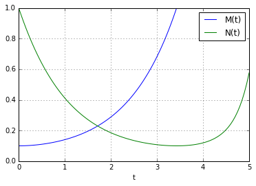
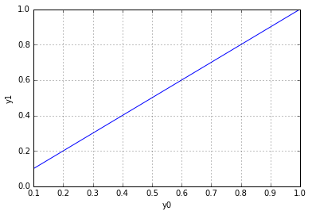

UECM3033 Assignment #3 Report
========================================================

- Prepared by: ** Ng Ann Chee**
- Tutorial Group: T2

--------------------------------------------------------

## Task 1 --  Gauss-Legendre formula

The reports, codes and supporting documents are to be uploaded to Github at: 

[https://github.com/annchee/UECM3033_assign3](https://github.com/annchee/UECM3033_assign3)

Explain how you implement your `task1.py` here.

We compute nodes or weights of gaussian quadrature by solving an eigenvalue problem.
This show as guasslegendre function in the task 1.

Explain how you get the weights and nodes used in the Gauss-Legendre quadrature.

The nodes are actually roots of the Legendre polynomials, and the corresponding weights must be obtained by solving a system of equations. Thus, we choose the n weights and the n points such that the error E(n) = 0 for all polynomials f of degree 2n − 1.
---------------------------------------------------------

## Task 2 -- Predator-prey model

Explain how you implement your `task2.py` here, especially how to use `odeint`.

To solve this equation with odeint, we must first convert it to a system of first order equations. By defining the first order equations, we obtain $${y'}_{0}=a(M-M*N)$$ $${y'}_{1}=b(-N+M*N)$$,where M=$y_{0}$ and N=$y_{1}$. Let y be the vector [M, N]. We implement this system in define function called as model.We assume that the constants are $a$=1.0 and $b$=0.2.Besides, we generate a solution 101 evenly spaced samples in the interval between 0 and 5.So, our array of times is $t=np.linspace(0,5,101)$. Call odeint to generate the solution. To pass the parameters a and b to model, we give them to odeint using the args argument.We define system of first order equation as model function in task 1. From the docs for odeint, $$odeint(model,y0,t,args=(a,b))$$, the t parameter represent as a sequence of time points for which to solve y.The $y_{0}$ represent as initial condition on y. The solution is an array with shape (101, 2). The first column is M(t), and the second is N(t). As a result, we plot and obtain the graph against $y_{0}$} and $y_{1}$ against t. In this task 1, we also plot another graph of $y_{1}$ against $y_{0}$.

Put your graphs here and explain.

Figure 1: Graph of $y_{0}$ and $y_{1}$ against $t$

Figure 2:Graph of $y_{1}$ against $y_{0}$

According to the figure 1, we can see that there is the intersection on the graph. The intersection point fall in value of t in between 1 and 2. The M(t) keep increase when value t is increasing.When approximate value of t between 3 and 4 is achieved, M(t) has higher value of differentiate value compared to N(t). As a result, we can see that the graph of M(t) very stable increasing. 

Is the system of ODE sensitive to initial condition? Explain.

Yes, the system of ODE sensitive to initial condition. Any point deviating from desired particular solution, even by only small amount, lies on different solution, and therefore rapid transient of general solution is present.
-----------------------------------

last modified: 18 April 2016
